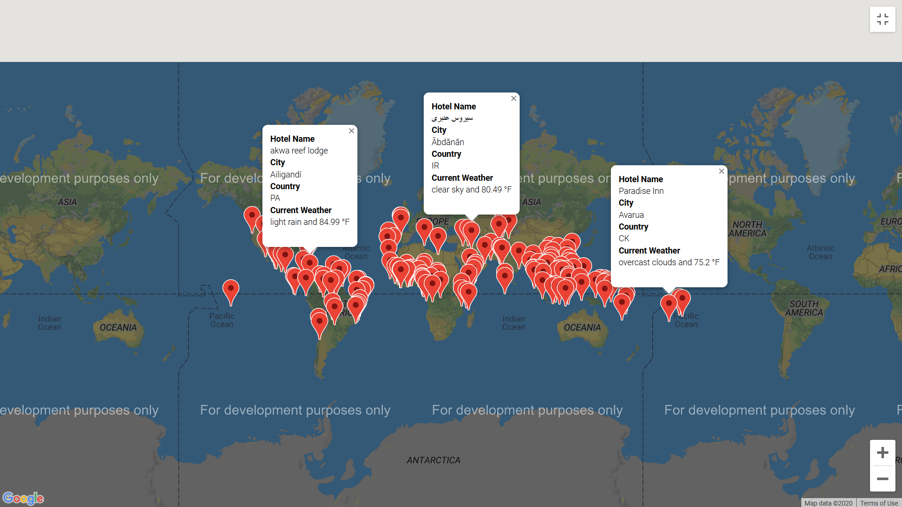
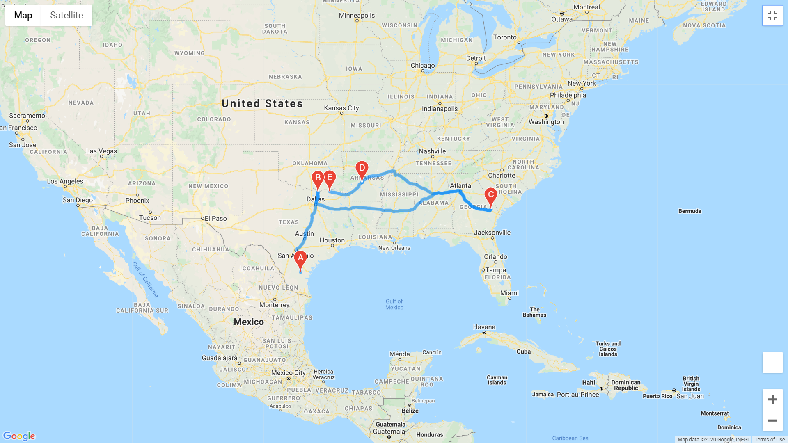
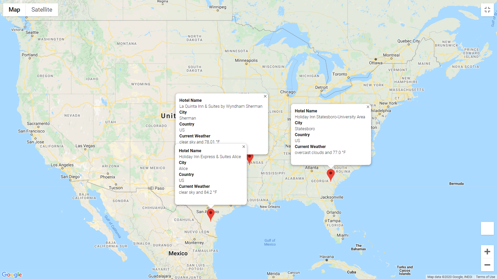

# World_Weather_Analysis

## Aim
The aim of this project is retrieve the weather data for a number of cities based and add the information to a map

## Process

The cities to be located on the map were generated as follows:

* Generate 1500 random pairs of latitude and logitude
* For each latitude-longitude pair, retrieve the name of the closest city using the citipy library
* For each city, send an API request to OpenWeatherMap to retrieve the weather conditions for that city
* Place all the weather information in a dataframe, display the contents of the dataframe in tabular format, and save its contents to a csv file
* Determine the number of cities that have receive rainfall or snow

Using another Jupyter notebook, prompt the user to specify their temperature and precipitation (rain and snow) preferences and, based on the user responses, from the cities that were retrieved in the previous step, select the cities that satisfy the user's preferences. Place markers for those cities on a weather map.

Select two cities, a start and a destination, and two or three way-points, on the same continent and, on a new weather map, show the path starting from the start city, going through the way-point cities, and ending at the destination.

Show the hotel information for the hotels that were closest to the selected locations' latitudes and logitudes and place them on a new WeatherMap:

Resources

OpenWeatherMap, citipy
